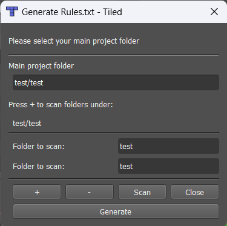

# Tiled Rules Generator

## Overview
Tiled Rules Generator is an extension for the Tiled Map Editor that will help you manage and generate rules.txt files. It enables you to consolidate rules from multiple folders into a single rules.txt file for use in your maps.

## Current Status: Work in Progress
This extension is currently in early development. At present, it only provides a user interface without full functionality.

### What Works Now:
- Dynamic UI for selecting the main project folder
- Adding/removing additional folders to scan
- Basic folder content scanning and logging
- UI resizing based on the number of folders added

### What's Coming:
- Actual rules.txt generation based on rules found in scanned folders
- Rule validation and conflict detection
- Rule merging and prioritization options
- Custom rule inclusion/exclusion

## Purpose
The purpose of this extension is to simplify the management of rule files in Tiled projects. Rather than manually creating and maintaining rules.txt files, this tool will:

1. Scan selected folders for rule files
2. Consolidate all found rules into a single rules.txt file
3. Place this file in your main project folder
4. Allow you to use all rules in one map without manual copying

This will be particularly useful for larger projects with many different tilesets and rules spread across multiple folders.

## Installation

1. Download the extension files
2. Place them in your Tiled extensions folder:
   - Windows: `%APPDATA%\Tiled\extensions\`
   - macOS: `~/Library/Preferences/Tiled/extensions/`
   - Linux: `~/.config/tiled/extensions/`
3. Restart Tiled
4. Access the tool from the Map menu: `Map > Generate Rules.txt`

## Usage

1. Open the dialog from the Map menu
2. Set your main project folder (where the final rules.txt will be placed)
3. Add additional folders to scan by clicking the "+" button
4. Remove folders by selecting them and clicking the "-" button
5. Click "Scan" to see the contents of the selected folders (currently only logs to the Tiled console)
6. Click "Generate" to create the rules.txt file (functionality not yet implemented)

## Contributing

This extension is open for contributions. If you'd like to help develop this tool, feel free to:

1. Fork the repository
2. Make your changes
3. Submit a pull request

### Development Focus Areas:
- Implementing the actual rules.txt generation functionality
- Improving the UI/UX of the extension
- Adding support for rule filtering or categorization
- Creating better documentation and examples

## License

[MIT License](LICENSE)

## Acknowledgements

- The [Tiled Map Editor](https://www.mapeditor.org/) team for their excellent map editor and extension API
- All contributors and testers of this extension